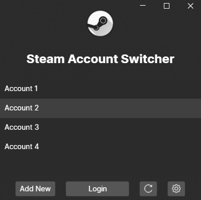

<h1 align="center"> 
  Steam Account Switcher 
</h1>

Fast account switcher for Steam. Switch accounts without entering your credentials or 2FA code. **Does not store any kind of user information or passwords**.

**Requires to be ran as administrator**

## Downloads

See [Releases](https://github.com/GuilhermeRaposo/Steam-Account-Switcher/releases) in the sidebar.

## Screenshots

## FAQ

#### How does it work?

1. It reads "/steampath/config/loginusers.vdf" to display all the accounts previously used on the machine.
2. Then edits the same file by changing the "MostRecent" field to "1" for the account selected.
3. Updates the registry value at "HKEY_CURRENT_USER\Software\Valve\Steam\AutoLoginUser" to the username.
4. And finally it ends the Steam process and restarts it again.

- To Steam it's like you never logged out in the first place

#### It asks for a password/2FA code after I make the switch

That is because you previously logged out using the steam client. The "Add New" button should be used to sign out as well as to add new accounts to the app.
